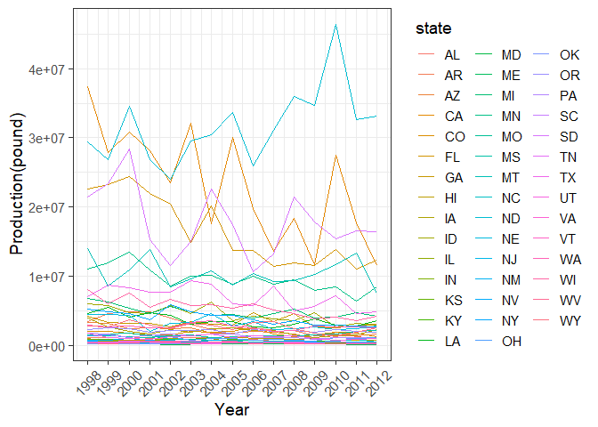

<!-- README.md is generated from README.Rmd. Please edit that file -->

# honeyproduction

<!-- badges: start -->
<!-- badges: end -->

The goal of honeyproduction package is to show summary information on
overall honey production by state, average value by state, as well as a
trend graph of overall production and a histogram of average honey unit
price by state, to help people better understand the data.

## Installation

You can install the development version of honeyproduction from
[GitHub](https://github.com/) with:

``` r
# install.packages("devtools")
devtools::install_github("etc5523-2022/rpkg-yche0537")
```

## Usage

### Data

``` r
library(honeyproduction)
HoneyProduction %>% head()
#>   state year numcol yieldpercol totalprod priceperlb prodvalue
#> 1    AL 1998  16000          71   1136000       0.72    818000
#> 2    AZ 1998  55000          60   3300000       0.64   2112000
#> 3    AR 1998  53000          65   3445000       0.59   2033000
#> 4    CA 1998 450000          83  37350000       0.62  23157000
#> 5    CO 1998  27000          72   1944000       0.70   1361000
#> 6    FL 1998 230000          98  22540000       0.64  14426000
```

Above is the subset view of the HoneyProduction data.

### Honey Production Shiny Application

You can also run the shiny application of the honey data by using below
syntax:

``` r
run_app()
```

### Honey production changing trend by year

``` r
production_plot()
```


You can use the function `production_plot` to get the overview plot
containing the curve of the change in the total honey production of each
state from 1998 to 2012.

Specifically the output is the line graph of the honey production value
for all states, regardless of whether argument has an input or not.

### Summary of Total Honey Production of US States(1998-2012)

``` r
yearly_production(2000)
#> # A tibble: 6 x 1
#>   .[,"  totalprod"]   
#>   <chr>               
#> 1 "Min.   :  192000  "
#> 2 "1st Qu.:  529500  "
#> 3 "Median : 1725000  "
#> 4 "Mean   : 5106000  "
#> 5 "3rd Qu.: 4670000  "
#> 6 "Max.   :34500000  "
```

This `yearly_production` function is used for showing the summary
information (i.e. minimum, Q1, median, Q3, maximum) of total production
of US in the period of 1998 to 2012.

### The Average Value of Every State

``` r
ave_value("AL")
#> # A tibble: 1 x 2
#>   state ave_value_dollar
#>   <chr>            <dbl>
#> 1 AL            1001933.
```

This is a function that can calculate the average honey value that
created by every state in US.

A tibble of dataset that contained the state name and mean honey value
of that state will be the output.

### Average price plot of honey in every state

``` r
price_plot("AL")
```


The `aveprice_plot function` returns a bar chart showing the average
price of honey in each state, with selected states highlighted and
others grayed out, meanwhile each state’s price data displayed on its
own bar.
